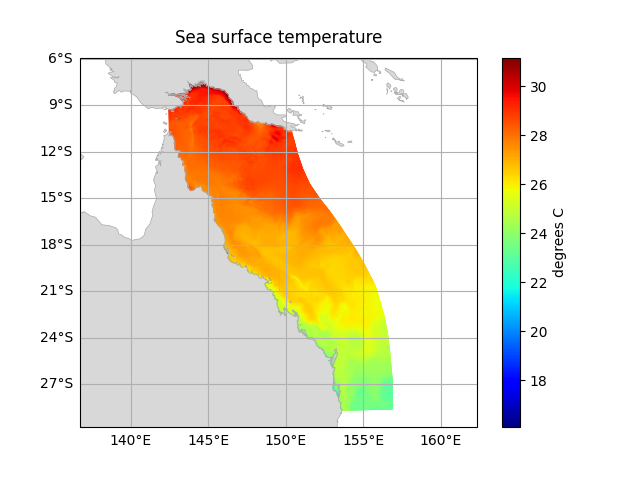

.. module:: emsarray

============================================
Coastal Environment Modelling dataset helper
============================================

The `emsarray` package provides a common interface
for working with the many model geometry conventions used at CSIRO.
It enhances `xarray`_ Datasets
and provides a set of common operations for manipulating datasets.

To use, open the dataset using either :func:`xarray.open_dataset` or :func:`emsarray.open_dataset`
and use the :doc:`dataset.ems </api/accessors>` attribute:

.. code-block:: python

    import json

    import emsarray
    from emsarray.operations import geometry
    from shapely.geometry import Point

    dataset = emsarray.tutorial.open_dataset('gbr4')

    # Select a single Point of data
    capricorn_group = Point(151.869, -23.386)
    point_data = dataset.ems.select_point(capricorn_group)

    # Export dataset geometry
    geometry.write_geojson(dataset, "gbr4.geojson")

    # Plot the sea surface temperature for time = 0
    temp = dataset['temp'].isel(time=0, k=-1)
    dataset.ems.plot(temp)

Contents
========

.. toctree::
    :maxdepth: 1

    installing.rst
    concepts/index.rst
    examples.rst
    api/index.rst
    cli.rst
    developing/index.rst
    testing.rst
    releases.rst

.. _xarray: https://xarray.pydata.org/
